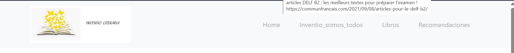

# Inventio literaria
Proyecto web creado con Django, HTML, CSS y bootstrap con el objetivo de promover la lectura a través de resúmenes breves y atractivos de libros. 

## Tecnologías usadas

- Django
- HTML
- CSS
- Bootstrap

# Funcionalidades
- Presenta una lista de libros mostrando el género literario
- Permite ver detalles individuales de cada libro
- Diseño responsive para todo tipo de dispositivos

# Capturas de pantalla

# Página de inicio

# Página inventio somos todos

#  Página libros
 

 
# Página Recomendaciones
[Recomendaciones](libros/static/img/shot6.png)

# Header

# Footer

# Autor 

Cristian Camilo Gómez Márquez
[LinkedIn](https://www.linkedin.com/in/cristian-camilo-gomez-marquez-1b2a20263/)

